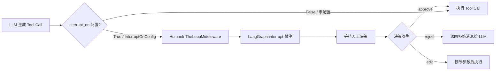
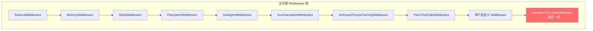
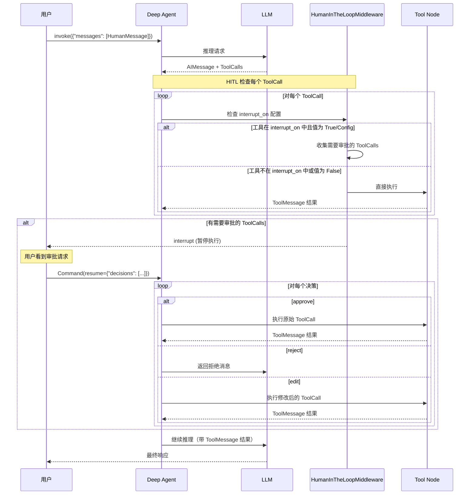
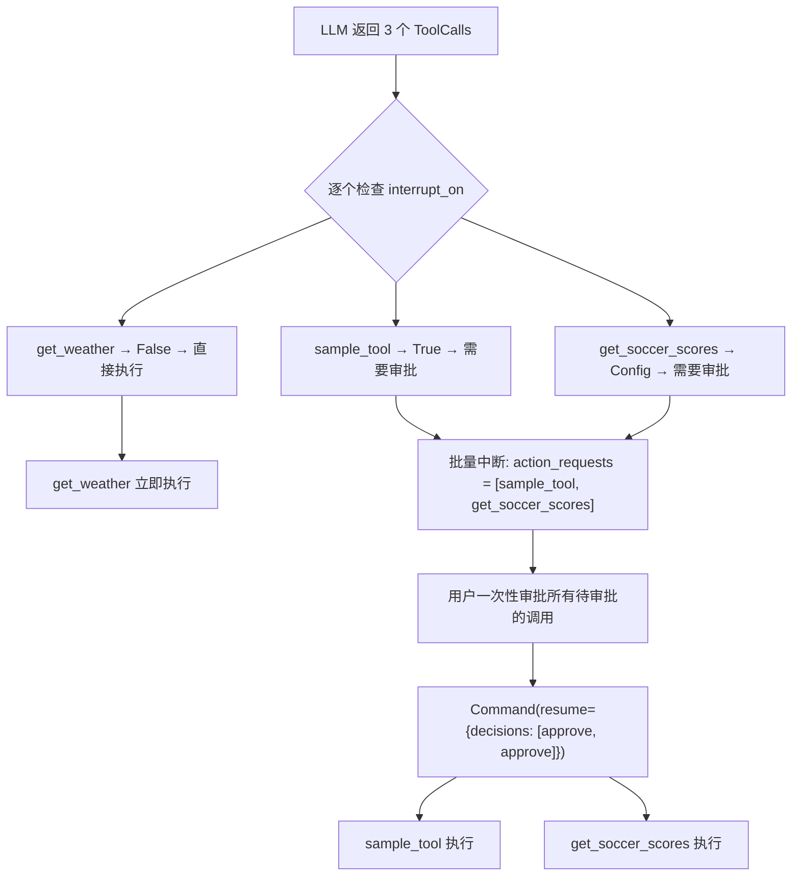

# Deep Agents Human-in-the-Loop (HITL) 机制详解

## 概述

Deep Agents 的 Human-in-the-Loop (HITL) 机制允许在 Agent 执行工具调用之前暂停执行，等待人工审批。这是一个关键的安全机制，特别是在涉及文件写入、Shell 命令执行、网络请求等具有副作用的操作时。

HITL 的核心实现依赖于：
1. **`HumanInTheLoopMiddleware`** — 来自 `langchain.agents.middleware`，作为 Middleware 栈的最后一层
2. **LangGraph `interrupt` / `Command(resume=...)` 机制** — 底层的暂停/恢复原语
3. **`InterruptOnConfig`** — 每个工具的中断配置（允许的决策类型、描述等）



## 核心数据模型

### `interrupt_on` 配置

`interrupt_on` 是一个字典，映射工具名称到中断配置：

```python
interrupt_on: dict[str, bool | InterruptOnConfig] | None
```

配置方式有三种：

| 配置值 | 含义 | 默认 `allowed_decisions` |
|--------|------|------------------------|
| `True` | 启用中断，使用默认配置 | `["approve", "edit", "reject"]` |
| `False` | 显式禁用该工具的中断 | — |
| `InterruptOnConfig` | 精细控制 | 自定义 |

### Middleware 栈中的位置

`HumanInTheLoopMiddleware` 始终是 Middleware 栈的**最后一层**。这意味着它在所有其他 Middleware 处理完毕后才介入，确保拦截的是最终要执行的工具调用。



## 完整执行流程

### 基本流程



## 并行工具调用的处理

当 LLM 在一次响应中发出多个工具调用时，HITL 会将需要审批的调用**批量收集**，一次性呈现给用户：



## CLI 中的 HITL 实现

Deep Agents CLI (`deepagents-cli`) 提供了两种 HITL 交互模式：交互式 (Textual TUI) 和非交互式。

### 交互式模式快捷键

| 快捷键 | 操作 |
|--------|------|
| `1` / `y` / `Enter`(选中 Approve) | 批准所有待审批的工具调用 |
| `2` / `n` / `Enter`(选中 Reject) | 拒绝所有待审批的工具调用 |
| `3` / `a` / `Enter`(选中 Auto-approve) | 启用自动批准（本次会话内所有后续调用自动批准） |
| `e` | 展开/折叠 Shell 命令详情 |
| `↑` / `k` | 向上移动选择 |
| `↓` / `j` | 向下移动选择 |

### 非交互式模式决策逻辑

非交互式模式使用基于规则的自动决策：

```python
def _make_hitl_decision(action_request, console):
    action_name = action_request.get("name", "")

    if action_name in SHELL_TOOL_NAMES:
        if not settings.shell_allow_list:
            return {"type": "reject", "message": "Shell commands not permitted..."}

        command = action_request.get("args", {}).get("command", "")
        if is_shell_command_allowed(command, settings.shell_allow_list):
            return {"type": "approve"}
        else:
            return {"type": "reject", "message": f"Command '{command}' not in allow-list..."}

    # 非 Shell 工具自动批准
    return {"type": "approve"}
```

## CLI 中被拦截的工具

在 CLI 的默认配置中（`auto_approve=False`），以下工具会触发 HITL 审批：

| 工具名称 | 说明 | `allowed_decisions` |
|----------|------|-------------------|
| `execute` | Shell 命令执行 | `["approve", "reject"]` |
| `write_file` | 写入文件 | `["approve", "reject"]` |
| `edit_file` | 编辑文件 | `["approve", "reject"]` |
| `web_search` | 网络搜索 | `["approve", "reject"]` |
| `fetch_url` | 获取 URL 内容 | `["approve", "reject"]` |
| `task` | 启动子代理 | `["approve", "reject"]` |

以下工具**不会**触发 HITL（只读操作）：
- `ls` — 列出目录
- `read_file` — 读取文件
- `glob` — 文件模式匹配
- `grep` — 文本内容搜索
- `write_todos` — 管理待办列表

## 安全建议

### 何时启用 HITL

| 场景 | 建议 |
|------|------|
| 使用 `FilesystemBackend`（直接访问本地文件系统） | **强烈建议**启用 HITL |
| 使用 `LocalShellBackend`（执行 Shell 命令） | **必须**启用 HITL |
| 使用 `StateBackend`（内存中操作） | 可选 |
| 使用 `BaseSandbox`（沙箱环境） | 可选，但建议对敏感操作启用 |
| 生产环境 | 根据信任级别决定 |

### 最佳实践

1. **最小权限原则** — 只对需要的工具启用中断，避免过度审批导致用户疲劳
2. **Shell 命令始终审批** — `execute` 工具可以绕过文件系统限制，应始终启用 HITL
3. **非交互式使用白名单** — 在 CI/CD 等非交互式场景中，使用 `--shell-allow-list` 限制允许的命令
4. **子代理配置** — 子代理可以有更宽松或更严格的 HITL 配置，根据其职责调整

---

**作者简介：** 桃慕，软件工程师，专注 AI Agent 系统研究与开发。

**本系列文章：**
- Deep Agents 架构全景
- Deep Agents Human-in-the-Loop 机制详解（本文）
- Deep Agents Memory 机制详解
- Deep Agents General-Purpose SubAgent 详解
