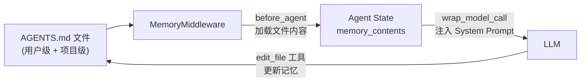
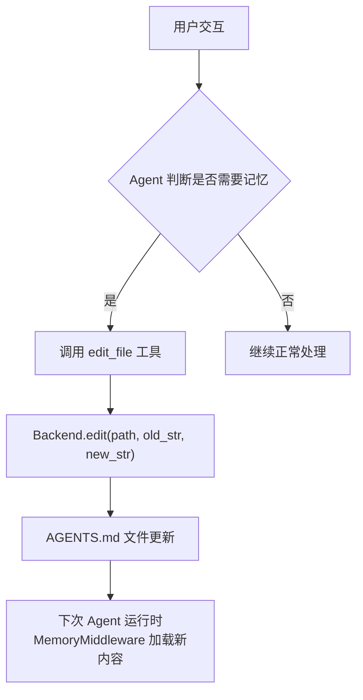

# Deep Agents Memory 机制详解

## 概述

Deep Agents 的 Memory 机制基于 [AGENTS.md 规范](https://agents.md/)，通过 `MemoryMiddleware` 从可配置的文件路径加载 `AGENTS.md` 文件，并将其内容注入到 LLM 的 System Prompt 中。与 Skills（按需加载的工作流）不同，Memory 是**始终加载**的持久上下文，为 Agent 提供项目特定的指令、用户偏好和工作规范。

Memory 的核心特性：

- 基于 `AGENTS.md` 规范，使用标准 Markdown 格式
- 支持多个 source 路径，按顺序拼接注入 System Prompt
- Agent 可通过 `edit_file` 工具主动更新记忆文件，实现持久学习
- 每次 Agent 运行只加载一次（已加载则跳过）
- 通过 Backend 抽象层访问文件，支持多种存储后端



## AGENTS.md 文件格式

`AGENTS.md` 是标准 Markdown 文件，没有强制的结构要求。常见的内容包括：

- 项目概述和架构说明
- 构建/测试命令
- 代码风格指南
- 用户偏好和工作习惯
- 工具使用说明

```markdown
# 项目指南

## 构建命令
- `make test` — 运行单元测试
- `make lint` — 代码检查

## 代码风格
- 所有函数必须包含类型注解
- 使用 Google 风格的 docstring
- 变量名尽量使用单个单词

## 用户偏好
- 偏好函数式编程模式
- 代码示例使用 Python 3.11+
- 回复使用中文
```

文件可以放置在两个层级：

| 层级 | 路径 | 作用域 | 说明 |
| --- | --- | --- | --- |
| 用户级 | `~/.deepagents/{agent_name}/AGENTS.md` | 全局 | 跨项目的个人偏好和通用指令 |
| 项目级 | `{project_root}/.deepagents/AGENTS.md` | 项目 | 项目特定的指南和规范 |
| 项目级 (根目录) | `{project_root}/AGENTS.md` | 项目 | 同上，另一个约定位置 |

## MemoryMiddleware 架构

### 生命周期钩子

`MemoryMiddleware` 实现了两个关键的生命周期钩子：

#### 1. `before_agent` / `abefore_agent` — 加载记忆

在 Agent 开始推理之前调用，从 Backend 下载所有配置的 source 文件：

```python
def before_agent(self, state, runtime, config) -> MemoryStateUpdate | None:
    # 1. 如果 memory_contents 已在 state 中，跳过加载
    if "memory_contents" in state:
        return None

    # 2. 解析 Backend（支持工厂函数）
    backend = self._get_backend(state, runtime, config)

    # 3. 批量下载所有 source 文件（单次 download_files 调用）
    results = backend.download_files(list(self.sources))

    # 4. 解析结果，跳过不存在的文件
    contents: dict[str, str] = {}
    for path, response in zip(self.sources, results):
        if response.error == "file_not_found":
            continue  # 文件不存在，静默跳过
        if response.error is not None:
            raise ValueError(f"Failed to download {path}: {response.error}")
        if response.content is not None:
            contents[path] = response.content.decode("utf-8")

    return MemoryStateUpdate(memory_contents=contents)
```

关键行为：
- **只加载一次**：如果 `memory_contents` 已存在于 state 中（来自之前的 turn 或 checkpoint 恢复），返回 `None` 跳过
- **批量下载**：所有 source 路径通过单次 `download_files()` 调用批量下载，而非逐个请求
- **容错处理**：`file_not_found` 错误被静默跳过，其他错误抛出 `ValueError`

#### 2. `wrap_model_call` / `awrap_model_call` — 注入 System Prompt

在每次 LLM 调用时，将记忆内容注入到 System Message 中：

```python
def wrap_model_call(self, request, handler):
    modified_request = self.modify_request(request)
    return handler(modified_request)

def modify_request(self, request):
    contents = request.state.get("memory_contents", {})
    agent_memory = self._format_agent_memory(contents)
    new_system_message = append_to_system_message(request.system_message, agent_memory)
    return request.override(system_message=new_system_message)
```

## System Prompt 注入机制

### MEMORY_SYSTEM_PROMPT 模板

`MemoryMiddleware` 使用一个精心设计的 System Prompt 模板，包含两个部分：

1. **`<agent_memory>` 标签** — 包裹实际的记忆内容
2. **`<memory_guidelines>` 标签** — 指导 Agent 何时以及如何更新记忆

实际注入到 System Prompt 中的效果：

```xml
<agent_memory>
~/.deepagents/agent/AGENTS.md
# 用户偏好
- 偏好函数式编程
- 使用 Python 3.11+

/project/.deepagents/AGENTS.md
# 项目指南
- FastAPI 后端
- 使用 PostgreSQL
</agent_memory>

<memory_guidelines>
    ...（记忆更新指南）...
</memory_guidelines>
```

## 记忆更新机制

Agent 通过 `edit_file` 工具更新 `AGENTS.md` 文件来实现记忆的持久化。这不是一个专门的记忆 API，而是复用了 `FilesystemMiddleware` 提供的文件编辑能力。



### 重要限制

- **当前会话不自动刷新**：`before_agent` 只在 `memory_contents` 不存在时加载。如果 Agent 在当前会话中通过 `edit_file` 更新了 `AGENTS.md`，System Prompt 中的记忆内容**不会**在同一会话中自动更新。更新后的内容将在**下一次** Agent 运行时生效
- **无冲突解决**：如果多个会话同时修改同一个 `AGENTS.md` 文件，后写入的会覆盖先写入的
- **文件大小无硬限制**：`MemoryMiddleware` 本身不限制文件大小，但过大的记忆文件会消耗 LLM 的上下文窗口

## Memory 与 Skills 的对比

`MemoryMiddleware` 和 `SkillsMiddleware` 都从 Backend 加载文件并注入 System Prompt，但设计目标和行为有显著差异：

| 维度 | MemoryMiddleware | SkillsMiddleware |
| --- | --- | --- |
| 文件格式 | `AGENTS.md` (自由 Markdown) | `SKILL.md` (YAML frontmatter + Markdown) |
| 加载方式 | 全量加载到 System Prompt | 渐进式披露 (只加载元数据) |
| 内容注入 | 完整文件内容注入 | 只注入名称+描述，Agent 按需 `read_file` |
| Agent 更新 | ✅ 通过 `edit_file` 更新 | ❌ 通常不由 Agent 修改 |
| 子代理继承 | ❌ 不自动继承 | ✅ 可通过 `skills` 参数配置 |

Memory 适合始终需要的上下文（项目规范、用户偏好），Skills 适合按需使用的工作流（研究流程、代码审查清单）。

---

**作者简介：** 桃慕，软件工程师，专注 AI Agent 系统研究与开发。

**本系列文章：**
- Deep Agents 架构全景
- Deep Agents Human-in-the-Loop 机制详解
- Deep Agents Memory 机制详解（本文）
- Deep Agents General-Purpose SubAgent 详解
